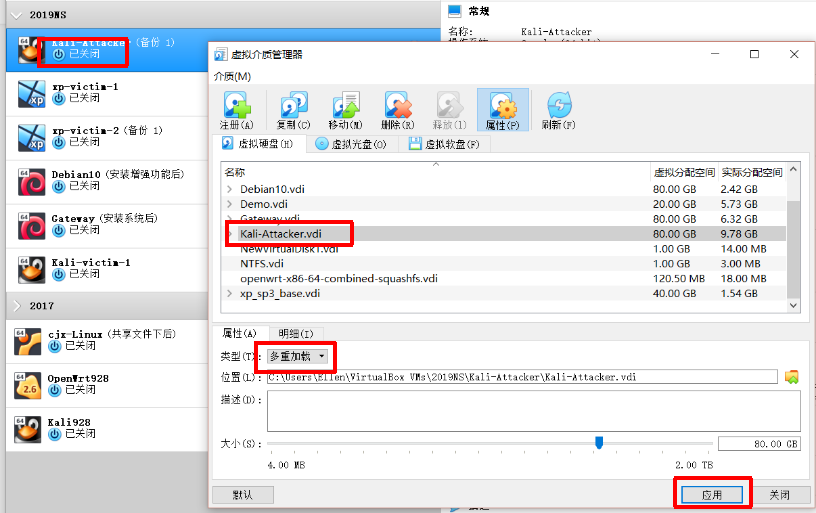

# chap0x01实验报告
## 基于 VirtualBox 的网络攻防基础环境搭建

### 一、实验要求
* 掌握 VirtualBox 虚拟机的安装与使用；
* 掌握 VirtualBox 的虚拟网络类型和按需配置；
* 掌握 VirtualBox 的虚拟硬盘多重加载；

### 二、实验过程
#### 1.虚拟硬盘多重加载
* 安装完虚拟机后，将系统更新并安装增强功能
* 将虚拟机关机，此时显示的是已关闭 
* 打开“管理——虚拟介质管理”，将虚拟机的类型选为多重加载，提示需要释放，确定即可，并应用

* 打开虚拟机设置-存储，没有控制器也没有盘片，选择添加虚拟硬盘，使用现有的虚拟盘，选择刚才的vdi即可
* 通过多重加载创建新的操作系统，只需要使用现有虚拟盘，括号内显示类型为多重加载


#### 2.网卡以及网络配置
* 靶机（ip：172.16.111.141）

* 网关（ip：10.0.2.15）

* 攻击者（ip：10.0.2.6）  

##### 网关NatNetwork网卡和攻击者的NatNetwork网卡处于一个网段
     ifconfig查看没启用的端口
     利用vim修改/etc/network/interfaces
     重新开启网卡
     再次查看，此时已经得到IP地址了
##### 靶机intnet网卡和网关的intnet网卡处于同一网段

##### 靶机配置默认网关
     在setting-network中手动配置默认网关为网关eth1（内部网络）的IP


#### 3.网络连通性测试
* 靶机可以直接访问攻击者主机
    * 靶机可以ping攻击者主机ip（攻击者ip：10.0.2.6）
    
* 攻击者主机无法直接访问靶机
    * 攻击者ping靶机ip失败（靶机ip：172.16.111.141）
    
* 网关可以直接访问攻击者主机和靶机
    * 网关ping靶机ip和攻击者ip成功
    
* 靶机的所有对外上下行流量必须经过网关  
     利用tcpdump -n -i enp0s9 icmp命令查看流量
    
* 所有节点均可以访问互联网  
    ping baidu.com 均成功
    


### 三、实验总结
* 网络拓朴图
    
* 相关配置
    * 攻击者
        * 开启dhcp服务
        ```
        vi /etc/network/interfaces 
        "auto eth0"  
        "iface eth0 inet dhcp"
        /etc/init.d/networking restart
        ```
    * 网关
        * 开启转发服务
        ```
        echo 1 > /proc/sys/net/ipv4/ip_forward  
        iptables -t nat -A POSTROUTING -o eth0 -s 192.168.56.105/24 -j MASQUERADE
        ```
        * 保存iptables表
        ```
        iptables-save -c > iptables.rules
        ```
        * 查看网关流量
        ```
        tcpdump -n -i enp0s9 icmp
        ```

- - -
* *参考资料*

    kali Linux 没有ip解决办法
    https://blog.csdn.net/valecalida/article/details/88569791